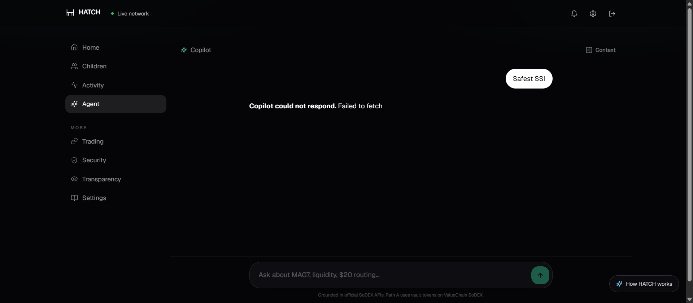
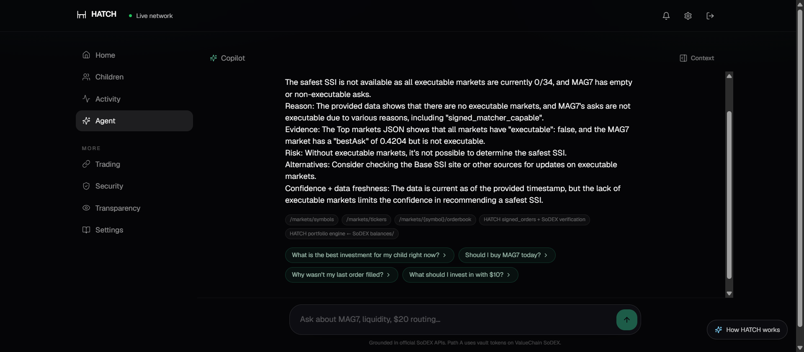

# Copilot Production Request Trace

Date: 2026-07-13  
Request: `Safest SSI`  
Frontend: `https://gethatch.vercel.app/app/agent`  
API: `https://hatch-api-h018.onrender.com`

## Result

The production failure was caused by a missing CORS response header on the
successful SSE response. It was not caused by provider selection, JWT
verification, Render sleep, DNS, TLS, a 404, or a provider outage.

`POST /api/ai/agent/stream` uses `reply.hijack()` and
`reply.raw.writeHead()`. That bypassed the headers normally added by Fastify's
CORS lifecycle. The backend accepted the request, returned HTTP 200, built
context, called the LLM, and streamed a complete answer. Chrome refused to
expose that response because it had no `Access-Control-Allow-Origin` header,
then Fetch surfaced `TypeError: Failed to fetch`.

## Production browser evidence

Failure screenshot:



Post-fix production validation:



Chrome DevTools request:

```text
URL: https://hatch-api-h018.onrender.com/api/ai/agent/stream
Method: POST
Browser status: net::ERR_FAILED
Origin: https://gethatch.vercel.app
Referer: https://gethatch.vercel.app/
Content-Type: application/json
X-HATCH-Profile: mainnet
Authorization: Bearer [redacted]
Body:
{
  "childId": "[redacted]",
  "messages": [{ "role": "user", "content": "Safest SSI" }]
}
```

Chrome Console:

```text
Access to fetch at
'https://hatch-api-h018.onrender.com/api/ai/agent/stream'
from origin 'https://gethatch.vercel.app' has been blocked by CORS policy:
No 'Access-Control-Allow-Origin' header is present on the requested resource.

Failed to load resource: net::ERR_FAILED
```

The same authenticated browser session successfully loaded:

```text
GET /api/children                         200
GET /api/sodex/markets/executable         200
GET /api/health                           200
GET /api/portfolio/:childId               200
POST /api/ai/agent/stream                 net::ERR_FAILED
```

`GET /api/children` included
`access-control-allow-origin: *`. The SSE request did not. This isolates the
failure to the hijacked SSE response, not global API routing or authentication.

## Full request path

| Hop | Evidence |
|---|---|
| Browser UI | User clicked `Safest SSI` on `/app/agent`. |
| Frontend handler | `Agent.tsx` called `submit("Safest SSI")`. |
| Fetch wrapper | `streamAgent()` built an authenticated `POST`. |
| Actual URL | `https://hatch-api-h018.onrender.com/api/ai/agent/stream` extracted from the deployed Vercel JS bundle. |
| DNS/TLS | Other requests to the same Render host returned 200; HTTPS was valid. |
| Network | Request body and headers were visible in Chrome DevTools. |
| Route | Fastify matched `POST /api/ai/agent/stream`. |
| Middleware | JWT and parent guard passed in the direct authenticated trace. |
| Context | Markets, family portfolio, and recent orders were read. |
| Provider | A configured provider returned tokens. |
| Server stream | HTTP 200, progress events, tokens, and `done` were emitted. |
| Browser stream | Blocked before JavaScript could access the HTTP response because the SSE 200 lacked ACAO. |
| UI error | Fetch rejected with `TypeError: Failed to fetch`; Agent rendered the error bubble. |

## Authenticated backend trace

The exact production request was replayed with a valid parent JWT generated
from the configured development credential and an existing parent/child row.
Secrets were redacted from output.

```text
0 ms       POST request started
611 ms     HTTP 200 response headers
611 ms     progress: markets active
611 ms     progress: portfolio active
611 ms     progress: orders active
734 ms     progress: orders done
2,577 ms   progress: portfolio done
12,679 ms  progress: markets done (3 executable)
12,679 ms  context built
12,679 ms  provider analysis started
12,969 ms  first answer token
13,751 ms  done event
13,752 ms  stream complete (210 SSE events)
```

Production response headers included:

```text
status: 200
content-type: text/event-stream; charset=utf-8
cache-control: no-cache, no-transform
transfer-encoding: chunked
x-render-origin-server: Render
access-control-allow-origin: [missing]
```

This proves the request reached the backend and completed through the LLM.

## Browser-to-API routing

The deployed frontend bundle contains:

```text
https://hatch-api-h018.onrender.com
```

Therefore this was not a `VITE_HATCH_API_BASE_URL` mismatch or a Vercel rewrite
failure. The page and API were both HTTPS, so there was no mixed-content block.

Health checks from the production page:

```text
GET /api/health     200 (first wake/read: 3,018 ms)
GET /api/ai/health  200 (540 ms)
```

Render was reachable and healthy.

## CORS and OPTIONS

Fastify's normal CORS handling works. Authenticated and unauthenticated JSON
responses include CORS headers. The defect was specifically the final
successful response written through Node's raw response after
`reply.hijack()`.

An intentionally invalid bearer request returned a readable CORS `401`:

```json
{
  "error": "unauthorized",
  "message": "Invalid or missing JWT"
}
```

That response did not use the hijacked successful SSE path.

## Provider evidence

Production `GET /api/ai/health` reported this configured order:

1. Groq (`llama-3.3-70b-versatile`)
2. NVIDIA primary (`deepseek-ai/deepseek-v4-flash`)
3. NVIDIA alternate (`openai/gpt-oss-120b`)
4. NVIDIA alternate 2 (`meta/llama-3.3-70b-instruct`)
5. Cerebras (`llama3.3-70b`)
6. SambaNova (`Meta-Llama-3.3-70B-Instruct`)

All NVIDIA models configured in `.env` are present. DeepSeek V4 Flash uses the
NVIDIA API endpoint corresponding to:
`https://build.nvidia.com/deepseek-ai/deepseek-v4-flash`.

The 210-event authenticated production trace proves at least one provider
completed. Provider selection was therefore not the cause of `Failed to fetch`.

## Fix

Only the SSE response/routing layer was changed:

- Reapply the configured CORS origin to the raw SSE response.
- Include `Access-Control-Allow-Credentials`.
- Include `Vary: Origin`.
- Expose `X-HATCH-Trace-Id`.
- Log request URL, method, origin, profile, role, body metadata, status, event
  count, duration, errors, and stack traces.
- Return a terminal SSE error with the trace ID if the route itself throws.

Trading, signing, relay, matcher capability, routing, and SoDEX execution were
not modified.

## Localhost comparison

Before the fix, production returned a complete SSE stream without ACAO.

After the fix, local validation from the configured local frontend origin
returned:

```text
URL: http://127.0.0.1:10000/api/ai/agent/stream
Origin: http://localhost:5173
Status: 200
Time to first SSE chunk: 21 ms
Content-Type: text/event-stream; charset=utf-8
Access-Control-Allow-Origin: http://localhost:5173
X-HATCH-Trace-Id: req-2
First events: markets active, orders active
```

Production uses its own `CORS_ALLOWED_ORIGINS` deployment setting. If it is
`*`, the raw SSE response now emits `Access-Control-Allow-Origin: *`; if it is
an explicit list, the request origin must match that list.

## Child-view wording verification

The product intentionally operates as a Family Portfolio Viewer. Production
was checked without changing the design.

Observed wording:

- `Your family's investing`
- `parent's shared SoDEX spot account`
- `not money allocated to you`
- `Managed by your parent`
- `read-only family account`
- `Family spot holdings`
- `Family account`
- `Parent-owned`
- `This is not an allocated balance for [child]`

No child page labels the family account as “your money,” “your balance,” “your
portfolio,” or “your investment.” “Your lessons” refers to child-specific
education, not asset ownership.

## Validation checklist

- [x] Deployed API URL extracted from production bundle
- [x] Browser Network request captured
- [x] Browser Console CORS error captured
- [x] Request URL, method, headers, and body captured
- [x] Authenticated backend request returned HTTP 200
- [x] Context builder completed
- [x] LLM emitted tokens
- [x] SSE emitted `done`
- [x] Missing production ACAO reproduced outside the browser
- [x] Local patched SSE returned ACAO and trace ID
- [x] Backend typecheck passed
- [x] Complete backend suite passed: 24 files, 85 tests
- [x] Production deployment contains commit `d9fa269`
- [x] Production browser `Safest SSI` completed after deployment

## Post-deployment production validation

The same authenticated Chrome session repeated the same UI action after Render
deployed the fix.

```text
POST https://hatch-api-h018.onrender.com/api/ai/agent/stream
Browser network status: 200
Fetch response type: cors
Time to response + first SSE chunk: 527 ms
Content-Type: text/event-stream; charset=utf-8
X-HATCH-Trace-Id: req-1e
First events: markets active, orders active
Console CORS errors: none
```

The UI rendered the streamed answer instead of `Failed to fetch`. This proves
the response now passes the browser's CORS enforcement and reaches
`streamAgent()`/`Agent.tsx`.

