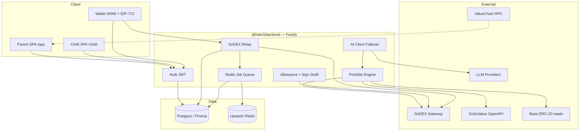
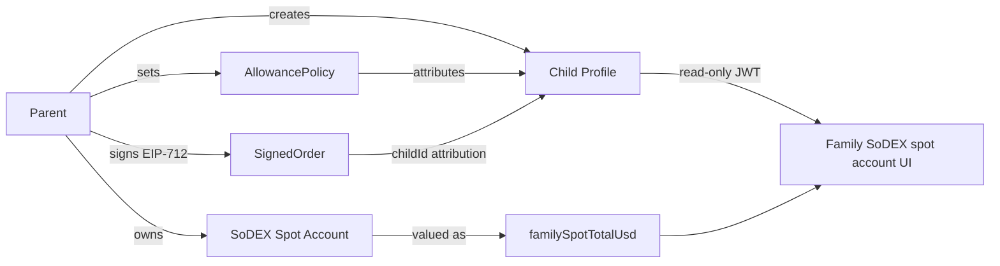
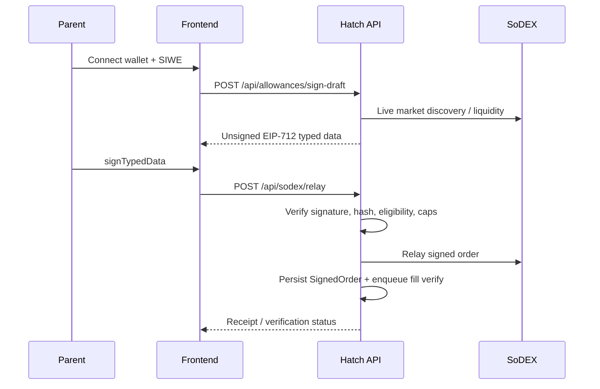
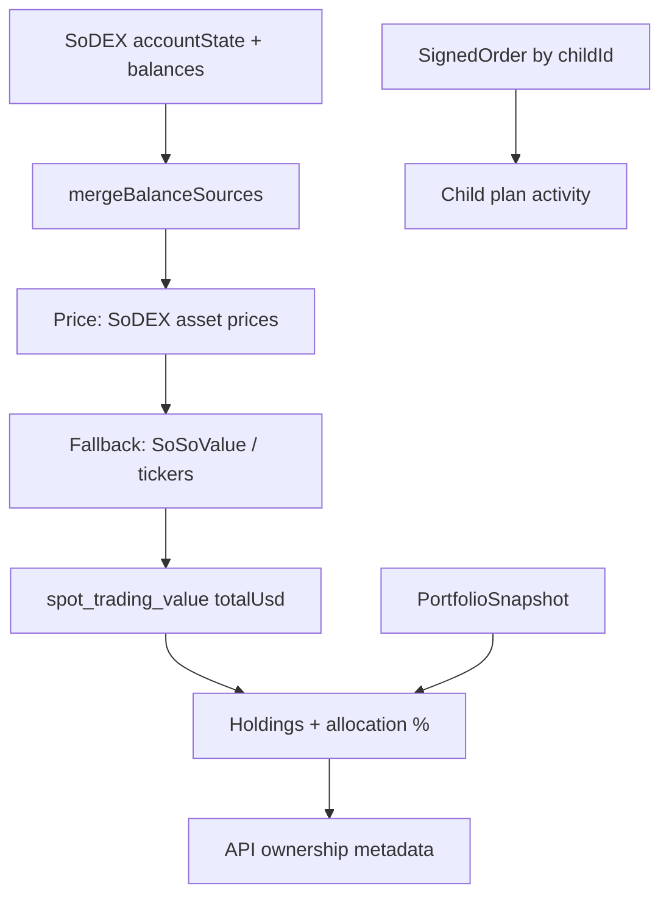
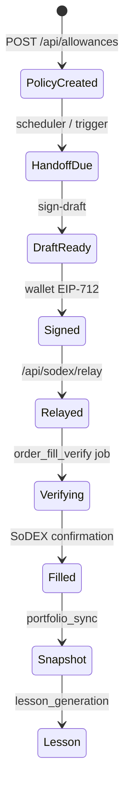

# HATCH

**Parent-signed family investing on SoDEX — with a read-only Family SoDEX spot account view and a grounded Investment Copilot.**

[](https://gethatch.vercel.app)
[](https://hatch-api-h018.onrender.com/api/health)
[](https://github.com/james32135/Hatch)
[](https://nodejs.org)
[](https://www.typescriptlang.org/)
[](https://fastify.dev/)
[](https://vitejs.dev/)
[](https://www.prisma.io/)
[](https://sodex.com)
[](https://main-scan.valuechain.xyz)

---

### Tagline

Parents approve weekly allowance investments in-wallet. HATCH relays parent-signed EIP-712 orders to SoDEX, values the shared family spot account from live balances, and explains activity to children through a look-only Family SoDEX spot account view.

---

### Live surfaces

| Surface | URL |
|---------|-----|
| Web app | https://gethatch.vercel.app |
| API health | https://hatch-api-h018.onrender.com/api/health |
| Repository | https://github.com/james32135/Hatch |
| SoDEX (mainnet) | https://sodex.com |
| ValueChain explorer | https://main-scan.valuechain.xyz |

```
┌──────────────────────────────────────────────────────────────────────┐
│                         HATCH SYSTEM MAP                             │
├──────────────┬───────────────────────────────┬───────────────────────┤
│   Frontend   │           Backend             │     External          │
│  Vercel SPA  │        Render Node            │                       │
│              │                               │                       │
│  /app/*      │  Fastify + JWT + Prisma       │  SoDEX gateway        │
│  /child/*    │  Redis jobs + SSE AI          │  SoSoValue OpenAPI    │
│  /login SIWE │  Parent-sign relay only       │  ValueChain RPC       │
│              │                               │  Base SSI balances    │
│              │                               │  Multi-provider LLM   │
└──────────────┴───────────────────────────────┴───────────────────────┘
```

---

## Table of contents

1. [Why HATCH](#why-hatch)
2. [Verified feature matrix](#verified-feature-matrix)
3. [Architecture](#architecture)
4. [Family investing model](#family-investing-model)
5. [Execution on SoDEX](#execution-on-sodex)
6. [SoSoValue SSI intelligence](#sosovalue-ssi-intelligence)
7. [Portfolio engine](#portfolio-engine)
8. [AI Copilot](#ai-copilot)
9. [Authentication & roles](#authentication--roles)
10. [Smart contracts](#smart-contracts)
11. [API surface](#api-surface)
12. [Frontend map](#frontend-map)
13. [Data & execution flows](#data--execution-flows)
14. [Jobs & background workers](#jobs--background-workers)
15. [Security model](#security-model)
16. [Deployment & environments](#deployment--environments)
17. [Technology stack](#technology-stack)
18. [Repository structure](#repository-structure)
19. [Local development](#local-development)
20. [Tests](#tests)
21. [License](#license)

---

## Why HATCH

### Problem

Family crypto investing collapses three hard constraints:

1. **Custody** — parents must keep signing authority.
2. **Attribution** — children need educational context without owning assets.
3. **Truth** — balances, fills, and market depth must come from live venues, not invented narratives.

### Solution

HATCH implements a **family_shared_spot_account** ownership model:

| Concept | Implementation |
|---------|----------------|
| Asset ownership | Parent SoDEX spot account |
| Child role | Read-only JWT (`read:portfolio`, `read:lessons` declared scopes) |
| Attribution | `childId` on plans, signed orders, lessons |
| Valuation | Live SoDEX balances → portfolio projection |
| Execution | Parent EIP-712 signature → backend relay → SoDEX |
| Education | Education Agent + Investment Copilot grounded in live context |

`childAllocationSupported: false` is explicit in the portfolio API. There is no child allocation ledger.

---

## Verified feature matrix

Evidence-backed checklist from this repository:

| Feature | Evidence |
|---------|----------|
| Parent dashboard | `frontend/src/pages/app/Dashboard.tsx` |
| Child look-only view | `frontend/src/pages/child/*` + `ChildGuard` |
| Family SoDEX spot account UI | `ChildPortfolio.tsx`, `ChildHome.tsx`, `PortfolioBalanceHero.tsx` |
| Live SoDEX portfolio | `GET /api/portfolio/:childId` + `portfolioEngine` |
| SSI / SoSoValue | `clients/sosovalue.ts`, `/api/ssi/*` |
| Investment Copilot | `/app/agent`, `/api/ai/agent`, `/api/ai/agent/stream` |
| Multi-provider AI failover | `clients/ai/index.ts` |
| Activity + receipts | `/app/activity`, `InvestmentReceipt.tsx`, `SignedOrder` |
| Allowance approval workflow | `/api/allowances/sign-draft` → wallet sign → `/api/sodex/relay` |
| Transparency page | `/app/transparency` |
| Security / ValueChain page | `/app/valuechain` |
| Wallet SIWE auth | `/api/auth/nonce`, `/api/auth/verify` |
| JWT + parent/child roles | `auth.ts`, `childAccess.ts` |
| Mainnet / testnet / mainnet-readonly | `config/environment.ts` |
| Smart contracts | `HATCHLog`, `HATCHSchedule` on ValueChain |
| Streaming AI (SSE) | `POST /api/ai/agent/stream` |
| Fill verification | `orderFillVerify.ts`, `/api/sodex/orders/:id/verification` |

---

## Architecture



### Layers

| Layer | Package / path | Responsibility |
|-------|----------------|----------------|
| Frontend | `frontend/` | Vite React SPA, wagmi/viem, TanStack Query |
| API | `packages/backend/` | Fastify routes, services, workers |
| Persistence | Prisma + Postgres | Users, children, policies, snapshots, orders, lessons |
| Cache / jobs | Upstash Redis | Capability cache, market cache, job queue + DLQ |
| Contracts | `packages/contracts/` | Foundry `HATCHLog` + `HATCHSchedule` |
| Web workspace stub | `packages/web/` | Workspace stub package (`echo` script only) |

---

## Family investing model



### Ownership contract (API)

From `GET /api/portfolio/:childId`:

```text
ownership.model  = family_shared_spot_account
ownership.owner  = parent
ownership.scope  = family
childAllocationSupported = false
valuation.scope  = spot_trading_value
```

UI language matches the model: **Family SoDEX spot account**, **Parent-owned**, **Managed by parent**, **Look only**, **not allocated child assets**.

---

## Execution on SoDEX

HATCH never holds parent SoDEX trading keys.



### Relay guards (code)

| Guard | Location |
|-------|----------|
| `KILL_SWITCH` | `sodex.ts` relay |
| `TRADING_ALLOWLIST` | wallet allowlist |
| Per-wallet rate limit | `relayRateLimit.ts` |
| `TRADING_MAX_NOTIONAL_USD` | `notional.ts` |
| `mainnet-readonly` write block | profile `writesAllowed: false` |
| Payload hash + signature verify | `sodexSign.ts` |
| Live market re-check | `marketLiquidity.ts` / capability |
| Eng-wallet mainnet cap | `mainnetTestGuard.ts` (1 USDC) |

### SoDEX gateways

| Profile | chainId | Spot REST |
|---------|---------|-----------|
| mainnet | `286623` | `https://mainnet-gw.sodex.dev/api/v1/spot` |
| testnet | `138565` | `https://testnet-gw.sodex.dev/api/v1/spot` |

---

## SoSoValue SSI intelligence

| Capability | Implementation |
|------------|----------------|
| Indices / snapshot / MAG7 constituents | `SoSoValueClient` → `/api/ssi/*` |
| Path A (SoDEX vault tokens) | Preferred parent flow in SSI capability matrix |
| Path B Base mint | Blocked for retail (WLP-only per whitepaper) |
| Base wallet SSI balances | `GET /api/ssi/balances/:address` |
| Mint / redeem / stake plans | `ssiFlows.ts` + `/api/ssi/flows/*` |
| Portfolio sync job | `POST /api/ssi/sync/portfolio` → `portfolio_sync` |

Official SSI protocol addresses on Base (8453) are registered in `config/addresses.ts` (`swap`, `factory`, `issuer`, `rebalancer`, `stakeFactory`, …).

---

## Portfolio engine



| Concern | Behavior |
|---------|----------|
| Valuation scope | Spot trading value only |
| Excludes | Non-spot books, EVM funding, external SSI staking (shown separately) |
| Child PnL / cost basis | `costBasisSource: "none"` — not fabricated |
| Snapshots | Parent-owned family value tagged by child context |
| Educational projections | Separate `projectionEngine` with documented yield bands (3% / 5% / 8%) |

---

## AI Copilot

### Surfaces

| Surface | Path / route |
|---------|--------------|
| Investment Copilot UI | `/app/agent` (parent only) |
| Non-stream agent | `POST /api/ai/agent` |
| SSE agent | `POST /api/ai/agent/stream` |
| Generic chat | `POST /api/ai/chat` |
| Education lessons | `POST /api/lessons/:childId/generate` |
| Provider health | `GET /api/ai/health` |

### Grounding

`buildAgentContext()` loads:

1. Executable SoDEX markets (liquidity scan + capability cache)
2. Family portfolio engine view (parent wallet balances)
3. Recent `SignedOrder` receipts

System prompt rules forbid inventing fills, balances, or depth, and forbid describing the family spot account as child-owned.

### Provider failover

Configured providers (env-gated; at least one required at boot):

| Priority | Provider ID | Adapter |
|----------|-------------|---------|
| 1* | `AI_PROVIDER` override (`nvidia` expands to 3 NVIDIA models) | — |
| 2 | `openai` | OpenAI SDK |
| 3 | `anthropic` | Anthropic SDK |
| 4 | `gemini` | Google REST + SSE |
| 5 | `groq` | OpenAI-compatible |
| 6 | `deepseek` | OpenAI-compatible |
| 7 | `openrouter` | OpenAI-compatible |
| 8–10 | `nvidia-primary`, `nvidia-alt`, `nvidia-alt2` | OpenAI-compatible |
| 11–15 | `cerebras`, `sambanova`, `together`, `mistral`, `xai` | OpenAI-compatible |
| 16 | `ollama` | Local OpenAI-compatible |

Mechanics: per-provider circuit breaker, retries on transient errors, stream→non-stream fallback, SSE `error` event if all providers fail.

### SSE event types

`progress` · `thinking` · `token` · `done` · `error`

CORS headers are reapplied on the hijacked SSE response (`Access-Control-Allow-Origin`, trace id).

---

## Authentication & roles

```mermaid
flowchart TD
  A[Wallet connect] --> B[GET /api/auth/nonce]
  B --> C[SIWE signMessage]
  C --> D[POST /api/auth/verify]
  D --> E[Parent JWT localStorage]
  E --> F[/app ParentGuard]
  F --> G[POST /api/auth/child-token]
  G --> H[/child#t=jwt]
  H --> I[Child JWT sessionStorage]
  I --> J[/child ChildGuard Look only]
```

| Role | JWT | Capabilities |
|------|-----|--------------|
| `parent` | `sub = User.id`, `wallet` | Children, allowances, relay, snapshots, AI, lesson generation |
| `child` | `sub = Child.id`, `childId` | Read portfolio + lessons for that child; no relay / policy writes |

Session isolation: parent JWT in `localStorage` (`hatch.jwt.parent`); child JWT in `sessionStorage` (`hatch.jwt.child`).

---

## Smart contracts

Foundry project: `packages/contracts/` (Solidity `^0.8.28`).

### `HATCHLog`

Append-only audit events. No custody. Not upgradeable.

| Event / function | Purpose |
|------------------|---------|
| `ChildRegistered` | Parent registers child lifecycle event |
| `AllowanceExecuted` | Parent emits allowance execution ref |
| `PolicyPaused` | Parent emits pause state |

### `HATCHSchedule`

On-chain transparency for allowance policy hash + `nextDueAt`.

| Function | Purpose |
|----------|---------|
| `upsertPolicy` | Parent writes policy view |
| `getPolicy` | Public read of policy hash / schedule |

### Deployed addresses

| Network | chainId | Contract | Address |
|---------|---------|----------|---------|
| ValueChain mainnet | 286623 | HATCHLog | `0x06a8ADeB3d1d1a4160606967308C275a627E4fCB` |
| ValueChain mainnet | 286623 | HATCHSchedule | `0xfdC9A9F19441f10729769393CBBD6d870802Ace9` |
| ValueChain testnet | 138565 | HATCHLog | `0xB4483128Bf95aa63621cB9EcA7f5d22a0d546b6C` |
| ValueChain testnet | 138565 | HATCHSchedule | `0x3db8750EE3a397b5A8A4e1842Bfb69f511342C6b` |

Verification APIs: `GET /api/valuechain/meta`, `GET /api/valuechain/contracts?network=mainnet|testnet`.

---

## API surface

~50 handlers across 15 route modules. Rate limit: **200 req/min**. Profile header: `X-HATCH-Profile`.

### Auth

| Method | Path | Auth |
|--------|------|------|
| GET | `/api/auth/nonce` | Public |
| POST | `/api/auth/verify` | Public |
| GET | `/api/auth/me` | JWT |
| POST | `/api/auth/child-token` | Parent |

### Children & portfolio

| Method | Path | Auth |
|--------|------|------|
| GET/POST | `/api/children` | Parent |
| PATCH | `/api/children/:id` | Parent |
| GET | `/api/portfolio/:childId` | Parent or matching child |
| GET | `/api/portfolio/:childId/history` | Parent or matching child |
| GET | `/api/portfolio/:childId/transactions` | Parent or matching child |
| POST | `/api/portfolio/:childId/snapshot` | Parent |

### Allowances & SoDEX

| Method | Path | Auth |
|--------|------|------|
| GET/POST/PATCH | `/api/allowances…` | Parent |
| POST | `/api/allowances/sign-draft` | Parent |
| GET | `/api/sodex/markets/executable` | Public |
| GET | `/api/sodex/readiness` | JWT |
| POST | `/api/sodex/relay` | Parent |
| POST | `/api/sodex/cancel-draft` | Parent |
| GET | `/api/sodex/orders/:id/verification` | Parent or child |

### SSI, AI, projections, ops

| Method | Path | Auth |
|--------|------|------|
| GET | `/api/ssi/*` | Public (except sync) |
| POST | `/api/ssi/sync/portfolio` | Parent |
| GET | `/api/ai/health` | Public |
| POST | `/api/ai/agent` / `/stream` | Parent |
| POST | `/api/lessons/:childId/generate` | Parent |
| GET/POST | `/api/projections/*` | Mixed (assumptions public) |
| GET | `/api/health`, `/live`, `/ready` | Public |
| GET | `/api/metrics`, `/api/config` | Public |
| POST | `/api/internal/heartbeat` | Cron secret |

---

## Frontend map

| Route | Audience | Page |
|-------|----------|------|
| `/` | Public | Landing (Silk WebGL hero) |
| `/login` | Public | SIWE sign-in |
| `/diag` | Public | Live health / metrics / contracts |
| `/app` | Parent | Dashboard |
| `/app/children/:id/*` | Parent | Portfolio, Allowance, Lessons, Projections, Invest |
| `/app/sodex` | Parent | Trading readiness |
| `/app/valuechain` | Parent | Security / contracts |
| `/app/transparency` | Parent | Live infra + custody notes |
| `/app/activity` | Parent | Approvals + receipts |
| `/app/agent` | Parent | Investment Copilot |
| `/app/settings` | Parent | Profile switch + child links |
| `/child` | Child | Today / Why / Learn / Family |

Guards: `ParentGuard`, `ChildGuard`. Child shell badge: **Look only**.

---

## Data & execution flows

### Investment lifecycle



### Activity timeline

Parent Activity page combines:

1. Allowance sign handoffs (`systemEvent` kind `allowance_sign_handoff`)
2. `SignedOrder` rows (receipts, statuses, SoDEX response JSON)
3. Verification endpoints for fill proof

---

## Jobs & background workers

Redis list queue (`hatch:jobs:queue` + DLQ). Scheduler in `jobs/scheduler.ts`.

| Job | Purpose |
|-----|---------|
| `portfolio_sync` | Snapshot non-paused children from parent SoDEX |
| `market_sync` | Cache SoSoValue indices / constituents |
| `allowance_scheduler` | Create due sign handoffs (no auto-trade) |
| `lesson_generation` | Education Agent on material portfolio delta |
| `order_fill_verify` | Confirm fills against SoDEX |
| `cleanup` | Prune old snapshots / events |

---

## Security model

| Control | Detail |
|---------|--------|
| Non-custodial trading | Backend relays parent signatures only |
| Eng key isolation | `SODEX_PRIVATE_KEY` for internal eng tests; not parent trading |
| Role enforcement | `requireParent` / `assertChildAccess` |
| Kill switch | `KILL_SWITCH` blocks relay |
| Notional caps | `TRADING_MAX_NOTIONAL_USD` |
| Profile write lock | `mainnet-readonly` |
| Helmet + CORS + rate limit | Fastify plugins |
| Child write isolation | Child JWT cannot relay or mutate policies |
| Transparency | Public metrics, contract verification, explorer links |

Custody statement in health/config responses: backend does not own parent SoDEX trading keys.

---

## Deployment & environments

| Component | Platform | Config |
|-----------|----------|--------|
| API | Render (`hatch-api`) | `render.yaml` |
| Frontend | Vercel | `frontend/vercel.json` |
| Database | Postgres (`DATABASE_URL`) | Prisma migrate on start |
| Redis | Upstash REST or `REDIS_URL` | Required at boot |

### Profiles

| Profile | chainId | writesAllowed |
|---------|---------|---------------|
| `mainnet` | 286623 | true |
| `testnet` | 138565 | true |
| `mainnet-readonly` | 286623 | false |

Selected via `HATCH_DEFAULT_PROFILE` and client header `X-HATCH-Profile`.

---

## Technology stack

| Area | Stack |
|------|-------|
| API | Fastify 5, TypeScript, Zod, Pino |
| Auth | SIWE, `@fastify/jwt` |
| ORM | Prisma 7 + Postgres |
| Cache / jobs | Upstash Redis / ioredis |
| Chain | viem, ValueChain + Base RPCs |
| Trading | SoDEX REST relay, EIP-712 |
| AI | OpenAI SDK, Anthropic SDK, Gemini REST, OpenAI-compatible providers |
| Frontend | React 18, Vite, TanStack Query, wagmi/viem, Framer Motion, Recharts, R3F Silk |
| Contracts | Foundry |

---

## Repository structure

```text
HATCH/
├── frontend/                 # Production Vite SPA (Vercel)
├── packages/
│   ├── backend/              # Fastify API + Prisma + jobs
│   ├── contracts/            # Foundry HATCHLog / HATCHSchedule
│   └── web/                  # Workspace stub
├── mcp_skills/               # MCP servers + Cursor agent skills
│   ├── mcp/                  # hatch-portfolio, hatch-sodex, hatch-ssi, hatch-copilot
│   ├── skills/               # Domain skills (portfolio, relay, SSI, education, copilot)
│   └── config/cursor.mcp.json
├── render.yaml               # API deploy
├── .env.example              # Full env contract
├── MARKET_PROBE_TESTNET.json # Market capability probe artifact
└── README.md
```

Backend source map:

```text
packages/backend/src/
├── routes/          # HTTP surface
├── services/        # Portfolio, SoDEX, SSI, AI agent, ValueChain
├── clients/         # sodex, sosovalue, ai
├── agents/          # education.ts
├── jobs/            # queue, workers, scheduler
├── config/          # env, environment, addresses
└── lib/             # prisma, redis, childAccess, errors
```

### MCP servers & agent skills

The `mcp_skills/` extension pack exposes HATCH to Cursor via four stdio MCP servers and five domain skills:

| Server | Tools |
|--------|-------|
| `hatch-portfolio` | Portfolio, history, transactions, children |
| `hatch-sodex` | Executable markets, readiness, order verification |
| `hatch-ssi` | SoSoValue indices, flows, balances |
| `hatch-copilot` | AI health, grounded agent queries, metrics |

```bash
cd mcp_skills && npm install
# Point Cursor MCP config at mcp_skills/config/cursor.mcp.json
# Set HATCH_JWT for authenticated portfolio and copilot tools
```

Skills live under `mcp_skills/skills/*/SKILL.md` — portfolio ownership, allowance relay, SSI research, child education, and Investment Copilot operations.

---

## Local development

```bash
cp .env.example .env
npm install
npm run prisma:generate
npm run dev:backend          # API on PORT (default 10000)
cd frontend && npm run dev   # SPA on :5173
```

Required: `JWT_SECRET`, `DATABASE_URL`, Redis (`UPSTASH_*` or `REDIS_URL`), `SOSO_API_KEY`, ≥1 AI provider key.

---

## Tests

Backend Vitest suite (`packages/backend/tests/`): auth, portfolio projection/engine, market liquidity, sign-draft/relay flows, SSI flows, ValueChain reads, AI provider order, investment agent helpers, jobs queue, and related unit coverage.

```bash
npm run test:backend
```

---

## Technical summary

HATCH is a non-custodial family investing system:

1. **Parents** authenticate with SIWE and sign SoDEX orders in-wallet.
2. **Backend** discovers markets, builds unsigned drafts, verifies signatures, relays to SoDEX, and verifies fills.
3. **Portfolio engine** values the parent-owned shared spot account and attributes plans/orders/lessons to children without inventing child ownership.
4. **Children** receive a look-only Family SoDEX spot account view.
5. **Investment Copilot** and Education Agent answer from live SoDEX + portfolio + receipt context with multi-provider failover and SSE streaming.
6. **HATCHLog / HATCHSchedule** provide ValueChain transparency without custody.

---

## Acknowledgements

Built on SoDEX execution, SoSoValue OpenAPI / SSI indexes, ValueChain EVM, Base SSI token contracts, and the multi-provider LLM stack configured in `packages/backend/src/config/env.ts`.

---

## License

Private buildathon / product repository. See repository access controls for distribution terms.
