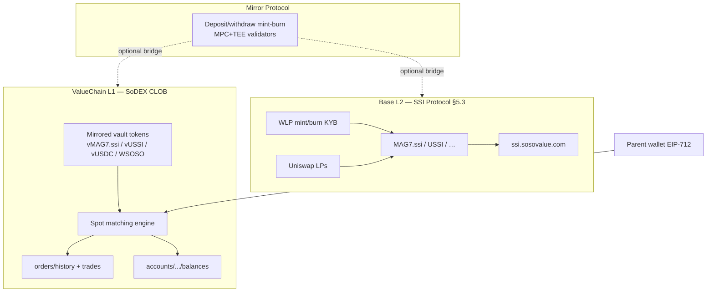
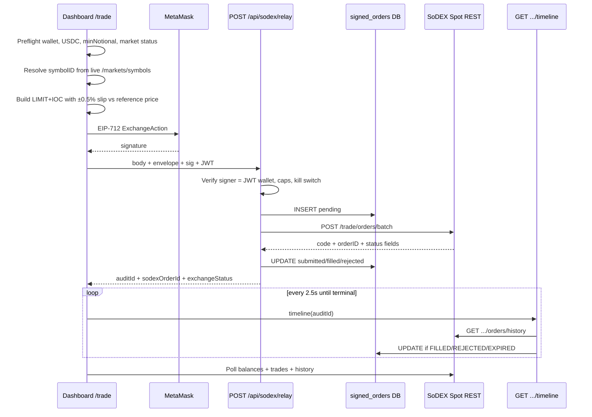

# ROOT_CAUSE_ANALYSIS.md

> **Mode:** Research only. No HATCH code fixes in this document.  
> **Date:** 2026-07-12  
> **Reference project:** `D:\route\sosomind` (architecture study only — not copied)  
> **Subject:** Why HATCH investments do not become FILLED / do not move SoDEX MAG7·USSI balances / do not move Base SSI  

---

## 0. Executive verdict

**The wallet signature and backend relay are not the primary failure.**

The proven root cause of the current Practice-network failure (Order ID = Synchronization Pending / WAITING_FOR_MATCH / SoDEX Trade History still only SOSO / SSI site still $0.03) is a **stack of protocol + market + product-architecture mismatches**:

1. **Testnet `vMAG7ssi_vUSDC` has zero ask liquidity** (live probe 2026-07-12). A BUY cannot fill.
2. **HATCH Balanced $6 collapses to a single MAG7 leg** (minNotional collapse), so the only order placed is on the **illiquid MAG7 book**.
3. **Buying SoDEX vault tokens does not update Base SSI** (`ssi.sosovalue.com`). That is protocol design (Whitepaper §5.3), not a missing HATCH sync job.
4. **sosomind never promised Path A → Base SSI.** It treats SSI as an *intelligence / routing* layer and executes **ordinary SoDEX spot** (often BTC/ETH proxies), with **REST polling** for fills — not WebSocket fill streams, not Base mint.

HATCH’s earlier “Submitted forever” UI bug was real and partially addressed. The **remaining demo failure is market selection + fill mechanics + SSI surface confusion**, not “missing SSI confirmation API.”

---

## 1. Questions answered (required)

| Question | Answer | Evidence |
|----------|--------|----------|
| When does an order become FILLED? | When the SoDEX matching engine fully executes it. Schema status **FILLED = 3**. | SoDEX Schema; live `orders/history.status` |
| What API confirms it? | `GET /accounts/{userAddress}/orders/history` (and optionally open `orders`). | Spot REST docs |
| What WebSocket confirms it? | **Official account-trades / order-update streams exist**, but **neither sosomind nor HATCH subscribe**. Both use **REST polling**. | SoDEX WS docs; sosomind `ws/server.ts` = prices only |
| Where does Trade ID come from? | `GET /accounts/{userAddress}/trades` → `tradeID` per fill. | Spot REST docs; live WSOSO trades |
| How are balances updated? | Matching credits vault balances; read via `GET .../balances` + `.../state`. | Spot REST; live balances |
| How are vault balances updated? | SoDEX spot balances are **ValueChain vault / mirrored tokens** (`vMAG7.ssi`, `vUSSI`, `vUSDC`, `WSOSO`). Updated by CLOB fills. | SoDEX Mirror notes (`sosomind/sodex.md`); live balances |
| How are SSI (Base) balances updated? | Only via **Base SSI protocol** (mint/burn/WLP, Uniswap, stake) or bridging — **not** by a SoDEX Path A fill. | Whitepaper §5.1–5.3 |
| Is SSI automatic after SoDEX buy? | **No.** | §5.3 mint is WLP/KYB; Path A is separate CLOB |
| Is SSI delayed? | N/A for Path A — wrong surface. | — |
| Is SSI another transaction? | Base mint/burn is a **different** flow (WLP). Retail uses secondary markets / SoDEX mirrored tokens. | §5.3 |
| Is SSI another service? | Yes: Base contracts + `ssi.sosovalue.com` + SoSoValue intel APIs. | §5.1 website |
| Is SSI another settlement layer? | Yes: Base SSI issuer/custody vs ValueChain SoDEX CLOB. | §5.3 + Mirror Protocol |
| Does buying `vMAG7.ssi` update Base `MAG7.ssi`? | **No.** | Observed: SoDEX has assets; SSI site MAG7=0; whitepaper mint path ≠ CLOB |
| Correct retail flow? | Sign → relay `batchNewOrder` → poll history/trades → **SoDEX balances** update. Base SSI site optional/unrelated unless user bridges or uses Base markets. | sosomind + docs |

---

## 2. Architecture diagrams

### 2.1 Official protocol surfaces (three layers)



### 2.2 Reference architecture — sosomind (observed)



**sosomind SSI role:** sector intel + optional “Follow SSI Basket” that maps to a **tradable SoDEX spot symbol**, often **BTC/ETH proxy** if basket assets are cancel-only. **No Path A vault product. No Base mint.**

### 2.3 Current HATCH architecture (observed)

```mermaid
sequenceDiagram
  participant UI as ChildAllowance
  participant MM as MetaMask
  participant Draft as POST /api/allowances/sign-draft
  participant Relay as POST /api/sodex/relay
  participant DB as signed_orders
  participant GW as SoDEX Spot REST
  participant V as GET .../verification

  UI->>Draft: policyId
  Draft->>GW: symbols + tickers
  Draft->>Draft: size MAG7/USSI legs; enforce minNotional $5
  Draft-->>UI: UNSIGNED typedData
  UI->>MM: EIP-712 ExchangeAction
  MM-->>UI: signature
  UI->>Relay: relayRequest + apiSign
  Relay->>DB: PENDING → SUBMITTED/FAILED
  Relay->>GW: POST /trade/orders/batch
  Relay->>Relay: parse legs; pollUntilTerminal ~22s
  Relay->>DB: sodexOrderId if present
  Relay-->>UI: signedOrderId + verification
  loop every 2s while waiting
    UI->>V: verification
    V->>GW: history + trades + balances
  end
```

**HATCH SSI role:** product story assumes Path A index exposure via **SoDEX vault symbols** `vMAG7ssi_vUSDC` / `vUSSI_vUSDC`. UI previously compared success to **Base SSI site** — incorrect surface.

---

## 3. Reference vs HATCH — protocol differences

| Dimension | sosomind | HATCH (current) | Impact |
|-----------|----------|-----------------|--------|
| Product intent | Research + discretionary SoDEX trading | Parent weekly allowance → index exposure for kids | Different success metric |
| SSI | Intel + basket→spot proxy | Hardwired MAG7/USSI Path A | HATCH depends on thin index books |
| Order construction | LIMIT+IOC, **buy @ ref×1.005** | LIMIT+IOC @ **mid/last** | HATCH less likely to cross ask |
| Preflight | Wallet, USDC, minNotional, **market status**, cancel-only block | Partial (minNotional warn; no ask-liquidity check) | HATCH can submit into empty asks |
| Symbol IDs | Live `/markets/symbols` always | Live at draft (fixed); meta still has mainnet defaults | Mostly OK now |
| Fill detection | REST poll timeline 2.5s + history | REST poll ~22s inline + client 2s verify | Similar model |
| WebSocket fills | Not used | Not used | Both poll-only |
| Relay parse | Reject if exchange status failed even on HTTP 200 | Parses leg `code`/`orderID` | Aligned directionally |
| Batch legs | Typically **one** spot order | Up to **two** legs; DB tracks **primary only** | Second leg invisible |
| Portfolio truth | SoDEX balances/trades UI | SoDEX + SoSoValue pricing | OK if fills happen |
| Base SSI site | Not a fill oracle | Documented as non-updating | Expectation bug |

---

## 4. Broken assumptions in HATCH

1. **“Relay accepted ⇒ investment happening”** — False. Acceptance ≠ FILLED. Official lifecycle: NEW → PARTIALLY_FILLED → FILLED / CANCELED / REJECTED / EXPIRED.
2. **“SSI portfolio (ssi.sosovalue.com) must move after Path A”** — False. Whitepaper mint is WLP on Base; Path A is ValueChain CLOB mirrored tokens.
3. **“MAG7 is always tradeable on testnet”** — False. Live book: **asks = []**.
4. **“Balanced $6 safely splits across MAG7+USSI”** — After minNotional collapse, Balanced equal sleeves become **one $6 MAG7 order** → hits the dead book.
5. **“Mid price is a safe IOC limit for buys”** — Dangerous when ask is missing or above mid. sosomind uses **+0.5% buy slip**.
6. **“Order ID Synchronization Pending means SSI lag”** — False. It means `sodexOrderId` missing and/or history row missing — relay/match problem, not Base SSI.
7. **“Lesson / ValueChain recorded can complete before fill”** — Was a UI heuristic bug; pipeline tightened, but success must still wait for FILLED.

---

## 5. Missing components (vs reference + docs)

| Component | Official / sosomind | HATCH gap |
|-----------|---------------------|-----------|
| Ask/bid liquidity preflight | sosomind preflight + orderbook usage in bots | **Missing** — no “asks empty ⇒ block BUY” |
| Market-style slip buffer | sosomind `ref * 1.005` | **Missing** — prices at mid |
| Liquid fallback market | sosomind SECTOR_PROXY → BTC/ETH | **Missing** — always MAG7/USSI |
| Timeline API refreshing DB from history | sosomind `/api/trading/orders/:id/timeline` | Partial (`/verification` exists; no continuous server sweeper) |
| Per-leg signed_order rows | Usually single order | Batch dual-leg **under-tracked** |
| WS accountTrade / order updates | Documented by SoDEX | **Unused** (optional acceleration) |
| Orderbook in sizing | Used in sosomind bot waterfall | **Unused** in allowance draft |
| Clear “wrong surface” UX for Base SSI | sosomind never shows Base SSI as fill proof | HATCH users still look at SSI site |

---

## 6. Exact root cause (proven)

### 6.1 Observed live market state (Practice / testnet)

**Probe:** `GET https://testnet-gw.sodex.dev/api/v1/spot/...` for wallet `0xf76e…71a3` on 2026-07-12.

| Market | bidPx | askPx | asks[] | Buy possible? |
|--------|-------|-------|--------|---------------|
| `vMAG7ssi_vUSDC` | 0.45 | **0** | **[]** | **No** |
| `vUSSI_vUSDC` | ~1.29 | ~1.29 | present | Yes (if sized correctly) |
| `WSOSO_vUSDC` | liquid | liquid | present | Yes (user’s real fills) |

User SoDEX Trade History shows **only SOSO/USDC buys** — consistent with liquid WSOSO, not MAG7.

### 6.2 Observed HATCH product behavior

- Weekly plan **$6 Balanced** → suggested notional ~$3 MAG7 + ~$3 USSI → each &lt; $5 minNotional → **collapse to single $6 MAG7 leg**.
- That leg targets a market with **no sellers**.
- Resulting states compatible with screenshots:
  - **WAITING_FOR_MATCH** / Synchronization Pending (no durable `orderID` in verification, or never enters history as fillable)
  - SoDEX portfolio unchanged for MAG7/USSI
  - SSI site unchanged (expected even on success)

### 6.3 Protocol root cause for SSI site

From Whitepaper **§5.1 / §5.3**:

- SSI tokens on **Base** are minted/burned via **WLP KYB** + PMM + custody.
- Retail secondary liquidity is Uniswap / mirrored venues.
- **SoDEX Path A** trades **ValueChain mirrored** `vMAG7.ssi` — a **different ledger**.

Therefore: **HATCH cannot “sync SSI” after SoDEX fill by calling a missing API.** The surfaces are different. Success criterion must be **SoDEX balances/trades**, not `ssi.sosovalue.com`.

### 6.4 Secondary root causes (historical, partially mitigated)

| Issue | Status |
|-------|--------|
| Relay marked SUBMITTED on HTTP only | Mitigated in recent HATCH fill-verify work |
| Hardcoded testnet USSI id 26 vs live 24 | Mitigated at sign-draft via live symbols |
| $2 allowance &lt; $5 minNotional | Mitigated with gate; user now on $6 |
| Pipeline advanced without FILLED | Mitigated in derivePipeline |
| No long-running fill sweeper | Still a gap vs sosomind timeline loop durability |

---

## 7. Mainnet vs Testnet audit notes

| Field | Testnet (live) | Mainnet (live / docs) | Rule |
|-------|----------------|------------------------|------|
| Chain ID | 138565 | 286623 | Never share |
| Gateway | `testnet-gw.sodex.dev` | `mainnet-gw.sodex.dev` | Profile header |
| `vMAG7ssi_vUSDC` id | **3** | **3** | Verify live |
| `vUSSI_vUSDC` id | **24** | **26** | **Must resolve live** |
| minNotional MAG7/USSI | **5** | **5** | From symbols API |
| MAG7 asks (sampled) | **Empty** | Must re-check at trade time | Preflight required |
| USSI asks (sampled) | Present | Must re-check | Preflight required |

**Never assume IDs or liquidity are equal across networks.**

---

## 8. Execution verification checklist (for the next real attempt)

Do **not** call it success until all checked against live APIs:

- [ ] Wallet EIP-712 signature (ExchangeAction)
- [ ] Relay HTTP + top-level `code===0` + leg `code===0` + `orderID`
- [ ] Row in `GET .../orders/history` with matching `clOrdID` / `orderID`
- [ ] Terminal status **FILLED** (not EXPIRED/CANCELED with qty 0)
- [ ] Row(s) in `GET .../trades` with `tradeID`
- [ ] `GET .../balances` **before vs after** delta on intended coin (`vUSSI` or `vMAG7.ssi`)
- [ ] HATCH portfolio shows that SoDEX delta (priced)
- [ ] SSI site: **explicitly N/A** unless a Base/bridge action was performed
- [ ] ValueChain receipt / explorer links for audit events (HATCH log) — separate from CLOB fill

If not filled, record exact reason from history status + orderbook snapshot at submit time.

---

## 9. Why the current attempt fails (plain language)

1. You signed a real SoDEX action.  
2. HATCH tried to buy **MAG7 on testnet**.  
3. **Nobody is selling MAG7 on that book right now** (`asks: []`).  
4. No fill ⇒ no Trade ID ⇒ no MAG7 balance change.  
5. SoDEX still shows your old **SOSO** trades.  
6. SSI site never moves from Path A — by design.  

This matches sosomind’s operational wisdom: **trade what is liquid on SoDEX; poll history until FILLED; do not treat Base SSI UI as the SoDEX fill oracle.**

---

## 10. Recommended rebuild direction (NO CODE YET)

When implementation is authorized, rebuild HATCH’s execution path to match **proven SoDEX mechanics** (as practiced by sosomind), not Base SSI fantasies:

1. **Preflight:** require non-empty asks for BUY; block or reroute if illiquid.  
2. **Sizing:** LIMIT+IOC with **buy slip** vs best ask / reference (sosomind pattern).  
3. **Instrument policy:** prefer liquid Path A markets; if MAG7 illiquid, use **USSI** when it has asks, or document Practice fallback — never pretend MAG7 filled.  
4. **Fill truth:** history + trades only; keep Verification panel; add durable timeline sweeper.  
5. **SSI education:** permanently separate “SoDEX vault holdings” from “Base SSI site holdings.”  
6. **Mainnet:** repeat liquidity + symbol-id probes independently before go-live.

---

## 11. Documentation sources used

### Official
- SoDEX Spot REST: https://sodex.com/documentation/trading-api/rest-v1/sodex-rest-spot-api  
- SoDEX Schema (order status enums): https://sodex.com/documentation/trading-api/rest-v1/schema.md  
- Account trades WebSocket (exists; unused by both apps): https://sodex.com/documentation/api/websocket-v1/account-trades  
- SSI §5.1 Overview: https://sosovalue-white-paper.gitbook.io/.../5.1-ssi-protocol-overview  
- SSI §5.3 Solution Design (WLP mint/burn, Base addresses): https://sosovalue-white-paper.gitbook.io/.../5.3-solution-design  

### Reference project (architecture only)
- `D:\route\sosomind\SOSOMIND_DOCUMENTATION.md` §§13–14  
- `D:\route\sosomind\packages\dashboard\src\lib\sodex-market.ts` (LIMIT+IOC + slip)  
- `D:\route\sosomind\packages\backend\src\routes\sodex-relay.ts`  
- `D:\route\sosomind\packages\backend\src\utils\sodexOrderParse.ts`  
- `D:\route\sosomind\packages\backend\src\routes\trading.ts` (timeline)  
- `D:\route\sosomind\sodex.md` (Mirror Protocol / vault notes)

### Live probes
- Testnet orderbooks/tickers/history/balances for `0xf76e…71a3` (2026-07-12)  
- HATCH screenshots: WAITING_FOR_MATCH, Synchronization Pending, SSI $0.03, SoDEX SOSO-only trades  

### HATCH internal
- `MEMORY.md` append (fill verification)  
- `packages/backend/src/services/orderFillVerify.ts`, `sodexSymbols.ts`, `parentSignDraft.ts`  

---

## 12. Remaining blockers before claiming demo success

1. **No ask liquidity on testnet MAG7** — cannot demonstrate MAG7 Path A fill until makers appear or Practice uses a liquid symbol.  
2. **Product policy** must choose: wait for MAG7 liquidity, route Balanced→USSI when MAG7 dead, or Practice-only liquid proxy (must be explicit, not silent).  
3. **Expectation management:** Base SSI site is **out of scope** for Path A fill proof.  
4. Implementation freeze until this RCA is accepted — then rebuild execution to match sosomind’s SoDEX mechanics.

---

## 13. Sign-off

| Claim | Proven? |
|-------|---------|
| Signature works | Yes (MetaMask ExchangeAction screenshots) |
| SoDEX REST is fill oracle | Yes (docs + sosomind + live history) |
| WS required for fills | No (optional; neither app uses it) |
| Base SSI auto-updates from Path A | **No — disproven** |
| Current $6 Balanced → MAG7 on empty ask book | **Yes — primary demo root cause** |
| Code patch alone without market/preflight change will “fix SSI” | **No** |

**Next step (when approved):** implement preflight + liquid-market execution policy + slip sizing + durable timeline, using this RCA as the contract — still no mocks, still no invented balances.
