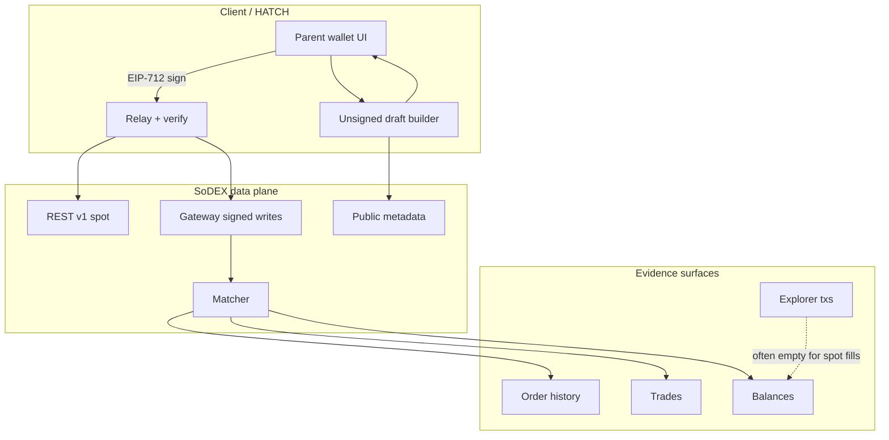
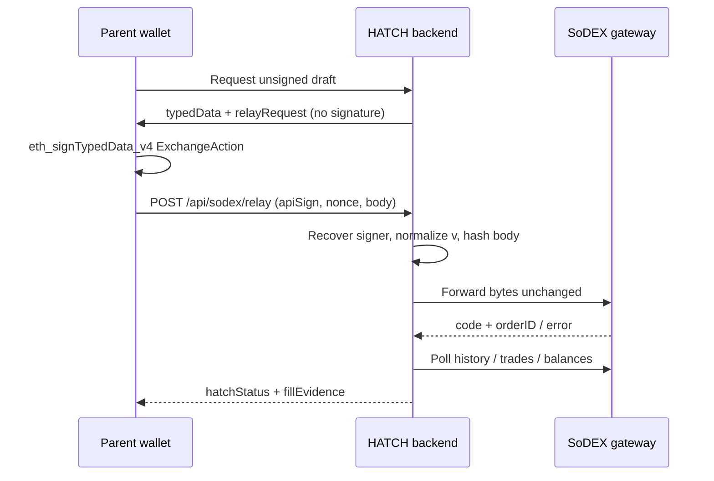

# SoDEX Order Engineering Guide

Permanent reference for integrating SoDEX spot correctly in HATCH (and any greenfield client).  
Frozen trading code in this repo should be treated as the verified baseline; this document explains **why**.

---

## 1. Complete SoDEX architecture

- **Public reads**: symbols, tickers, orderbooks — document `status` as `TRADING | HALT` only.
- **Signed writes**: `POST/DELETE /trade/orders/batch` with EIP-712 `ExchangeAction`.
- **Truth for fills**: order history + trades + balance deltas — never HTTP 200 alone.

---

## 2. Network differences

| | Testnet | Mainnet |
|--|---------|---------|
| Spot REST | `https://testnet-gw.sodex.dev/api/v1/spot` | `https://mainnet-gw.sodex.dev/api/v1/spot` |
| Chain ID (EIP-712 / `X-API-Chain`) | `138565` | `286623` |
| Symbol IDs | **Do not reuse mainnet IDs** | Independent catalog |
| Capability | Probe independently | Probe independently; never copy testnet safe lists |
| Explorer | `clobscan-testnet.sodex.dev` | mainnet explorer |

HATCH profile header: `X-HATCH-Profile: testnet | mainnet | mainnet-readonly`.

---

## 3. Wallet mapping

- Master wallet signs `ExchangeAction` (or registered API-key pubkey).
- Backend recovers signer and requires match to authenticated parent wallet.
- Portfolio reads use **parent wallet** from DB — child tokens are view-only.

---

## 4. Account mapping

1. Resolve SoDEX account ID from `GET /accounts/{wallet}/state` (`aid` / `accountID`).
2. Bind drafts and batch bodies to that `accountID`.
3. Never hardcode account IDs across networks.

---

## 5. Signing flow

---

## 6. EIP-712 payload

- Domain: `name=spot`, `version=1`, `chainId=<network>`, `verifyingContract=0x000…000`
- Primary type: `ExchangeAction`
- Message: `{ payloadHash: bytes32, nonce: uint64 }`
- `payloadHash = keccak256(utf8(JSON.stringify({ type, params })))` compact JSON
- Wire signature: `0x01` + ECDSA with recovery byte in `{0,1}` (normalize MetaMask 27/28)

Action types: `batchNewOrder`, `batchCancelOrder`.

---

## 7. Relay flow

1. Auth + rate limit + kill switch.
2. Verify signer == parent (or API key).
3. Assert body hashes to signed `payloadHash`.
4. Re-check market still executable (capability + book) — **do not re-sign**.
5. Forward to SoDEX with `X-API-Sign`, `X-API-Nonce`, `X-API-Chain`.
6. Persist response; on cancel-only invalidate capability; on accept record matcher evidence.
7. Poll until terminal; require fill evidence for FILLED.

---

## 8. Capability probing

Engineering probe (`probe-sodex-market-capabilities.mts --execute`):

For each symbol: LIMIT IOC $5/$10, MARKET IOC $5/$10, LIMIT GTC $5/$10 (+ cancel).

Persist exact gateway codes, order IDs, trades, balances into `MARKET_PROBE_TESTNET.json`, then seed Redis capability records.

---

## 9. Why REST `TRADING` is NOT enough

Official schema exposes only `TRADING | HALT`.  
Matcher may still reject with `symbol is in cancel only mode` while REST says `TRADING` and UI `tradeSwitch=true`.

---

## 10. Meaning of Cancel Only

Undocumented matcher execution mode: **new orders rejected**; cancels may still work.  
Detected from signed write errors (`/cancel.?only/i`), not from REST status.

---

## 11. Matcher capability

Proven when gateway accepts **and** an `orderID` appears in open/history state.

---

## 12. Gateway capability

HTTP reaches write endpoint with application `code === 0` (and per-order ok).  
Distinct from “orderbook HTTP ok” (public read).

---

## 13. How executable markets are discovered

1. Live symbols + orderbooks + dry LIMIT+IOC serialization.
2. **Plus** fresh signed capability: `matcherAccepted && !cancelOnly` for invest mode (`LIMIT_IOC`).
3. UI labels: `MATCHER_OK` / `FILL_OK` / `CANCEL_ONLY` / `UNVERIFIED` / `FAIL`.

---

## 14. How markets are rejected

| Reason | Source |
|--------|--------|
| Cancel only | Signed write / capability negative |
| Empty ask / wide spread* | Book |
| Tick / precision / minNotional | Meta + dry |
| MissingOraclePrice (MARKET) | Prefer LIMIT IOC |
| Unverified | No signed capability |

\*Spread gate waived when signed matcher capability exists (testnet books can be wide yet fillable).

---

## 15. Capability cache

Redis keys: `sodex:cap:{network}:{SYMBOL}:LIMIT_IOC`  
Memory fallback if Redis write fails.

---

## 16. TTL strategy

| Evidence | TTL |
|----------|-----|
| Live positive (relay) | 5 minutes |
| Probe-seeded positive | 6 hours |
| Cancel-only negative | ≥15 minutes (probe seed 24h) |

Invalidate immediately on cancel-only / HALT / metadata ID change.

---

## 17. Probe strategy

Never certify user execution with a shared wallet for production UX claims — probe wallet should match the certified identity class.  
Mainnet writes require explicit approval and caps.

---

## 18. How to verify a market

1. REST `status=TRADING` (necessary, not sufficient).
2. Book has asks for the intended notional.
3. Signed LIMIT IOC accepted → order history row.
4. Prefer fill proof for ranking (`FILL_OK`).

---

## 19. How to verify a fill

All required:

- Terminal status FILLED (or partial with qty > 0)
- `executedQty > 0`
- ≥1 trade ID
- Balance evidence consistent

Never mark FILLED from relay HTTP alone.

---

## 20. Trade history verification

`GET /accounts/{wallet}/trades?symbol=…`  
Match `orderID` / `clOrdID`.

---

## 21. Balance verification

`GET /accounts/{wallet}/balances` (+ account state).  
Parse both verbose rows and compact `B[{a,t}]` forms.

---

## 22. Explorer limitations

Testnet explorer account transactions may return **empty** while SoDEX history/trades show fills.  
Do not require explorer txs for product “filled” — keep `verifiedSafe` false until linkage is proven.

---

## 23. Why `verifiedSafe` may remain false

Strict definition includes explorer confirmation. Explorer linkage is currently unproven → safe list can be empty while matcher-capable markets still route.

---

## 24. Production pitfalls

- Treating dry payload / orderbook as gateway acceptance
- Copying testnet symbol IDs to mainnet
- Wrong `X-API-Chain` / EIP-712 chainId
- Signature `v=27/28` without normalization
- Claiming FILLED without trades
- Showing cancel-only markets as buyable
- Portfolio UI waiting on “SSI confirmation” when SoDEX balances are simply unpriced

---

## 25. Common integration mistakes

1. Market orders on symbols needing oracle → `MissingOraclePrice`
2. Padded decimal strings rejected by tick rules
3. Caching eligibility without signed capability
4. Reading portfolio on wrong network profile after a testnet fill
5. Generating lessons with no portfolio delta → spam “flat” copy

---

## 26. Greenfield SoDEX integration checklist

1. Wire REST reads from official schema.
2. Implement EIP-712 `ExchangeAction` exactly.
3. Build unsigned drafts; parent signs; relay only.
4. Parse gateway top-level **and** per-order codes.
5. Poll history/trades/balances for terminal truth.
6. Maintain capability store from probes + live rejects.
7. Never show buyable without matcher capability.
8. Price portfolio from balances + tickers; never invent APYs.

---

## 27. Troubleshooting

| Symptom | Check |
|---------|-------|
| `symbol is in cancel only mode` | Capability negative; pick matcher-capable market |
| `API key not found` | Signature/hash/chain mismatch |
| FILLED in UI but no trade | Wait for indexing; re-poll trades |
| Portfolio “Waiting…” after fill | Profile network; balance parse; ticker price for base asset |
| Repeated flat lessons | Ensure `triggerDelta` on lesson jobs |
| Empty executable list | Re-run probe / seed capability; check cancel-only cache |

---

## API quick reference

| Method | Path | Auth |
|--------|------|------|
| GET | `/markets/symbols` | Public |
| GET | `/markets/{symbol}/orderbook` | Public |
| GET | `/accounts/{addr}/state` | Public |
| GET | `/accounts/{addr}/balances` | Public |
| GET | `/accounts/{addr}/orders/history` | Public |
| GET | `/accounts/{addr}/trades` | Public |
| POST | `/trade/orders/batch` | Signed |
| DELETE | `/trade/orders/batch` | Signed |

Official schema: [SoDEX REST v1 schema](https://sodex.com/documentation/trading-api/rest-v1/schema.md)
